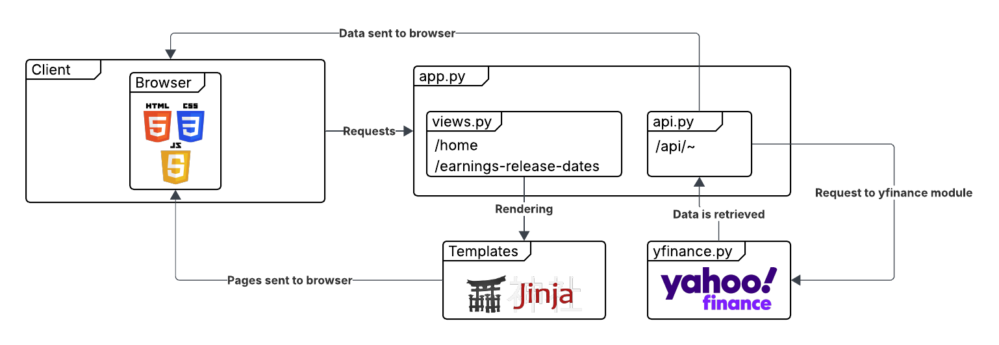
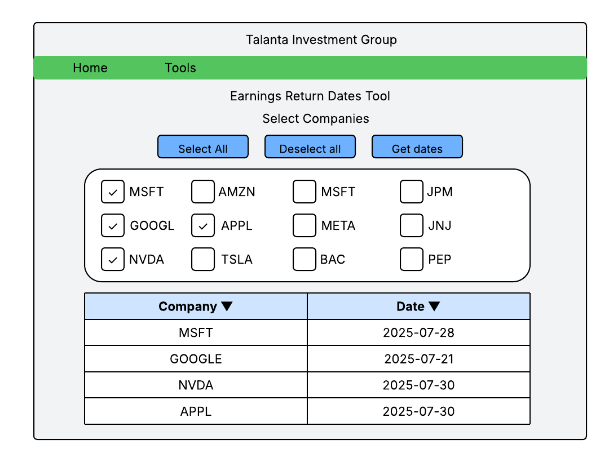

# Talanta Investment Group -- Interview Project

### Author: Heath Dyer

### Directions

Please build a simple website interface (UI) with a Python backend that retrieves upcoming earnings release dates for a small set of companies of your choosing. The data should be sourced from publicly available platforms such as Yahoo Finance or similar.

# Requirements

### Functional Requirements

* [FR 1.0] The system shall display a dropdown list of predefined companies' ticker symbols (ex. APPL, MSFT, AMZN, GOOGL, NVDA).
* [FR 1.1] The system shall allow the user to select one or more companies from the list.
* [FR 1.2] The system shall allow the user to select all or deselect all companies from the list at once.
* [FR 1.3] The system shall retrieve the next upcoming earnings release date for all selected companies when the user submits the form.
* [FR 1.4] The system shall display the earnings date in a table format.
* [FR 1.5] The system shall allow the user to sort the table by the company name or the release date.

### Non-Functional Requirements

* [NFR 1.0] The application must be developed with a Python backend.
* [NFR 1.1] The application must use publicly available platforms (ex. Yahoo Finance)
* [NFR 1.2] The system shall respond to user requests within 2 seconds under normal load
* [NFR 1.3] The system must be accessible via a standard web browser

# Design

## Architecture



## Wireframe



## RESTful API

| Method | Route | Description
| --- | --- | --- |
| `GET` | `/api/tickers` | Retrieves an array of ticker symbols |
| `POST` | `/api/earnings-release-dates` | Given an array of ticker symbols, retireves the earnings release dates for those tickers |

## ` GET /api/tickers`

Example output

```
[
  "AAPL",
  "MSFT",
  "GOOGL",
  "AMZN",
  "TSLA",
  "META",
  "NVDA",
  "JPM",
  "V",
  "JNJ",
  "WMT",
  "PG",
  "MA",
  "DIS",
  "HD",
  "BAC",
  "PEP",
  "KO",
  "XOM",
  "NFLX"
]
```

## `POST /api/earnings-release-dates`

### Example Input

JSON array of ticker symbols.

```
[
  "AAPL",
  "MSFT",
  "GOOGL",
  "NVDA",
]
```
### Example output

Array of JSON objects with ticker name and earnings release date information.

```
[
    {
        'ticker': 'AAPL',
        'earnings_date': '2025-07-30'
    },
    {
        'ticker': 'MSFT',
        'earnings_date': '2025-07-28'
    },
    {
        'ticker': 'GOOGL',
        'earnings_date': '2025-07-21'
    },
    {
        'ticker': 'NVDA',
        'earnings_date': '2025-05-28'
    }
]
```

# Tech Stack

| Resource | Purpose | Lisence 
| --- | --- | --- |
| [HTML](https://developer.mozilla.org/en-US/docs/Web/HTML) | Standard web markdown language for web views | MIT License |
| [CSS](https://developer.mozilla.org/en-US/docs/Web/CSS) | For page styling | MIT License |
| [JavaScript](https://developer.mozilla.org/en-US/docs/Web/JavaScript) | For client-side dynamic web functionality | MIT License |
| [Python](https://docs.python.org/3/) | For server-side web functionality | [License](https://docs.python.org/3/license.html) |
| [Flask](https://flask.palletsprojects.com/en/stable/) | Lightweight microframework for web developmment in Python | [BSD3 License](https://flask.palletsprojects.com/en/stable/license/) |
| [Jinja2](https://jinja.palletsprojects.com/en/stable/) | Templating engine for backend dynamic rendering| [BSD3 License](https://jinja.palletsprojects.com/en/stable/license/) |
| [yfinance](https://pypi.org/project/yfinance/) | Provies API interface to retrieve data from Yahoo Finance | [Apache Software License](https://www.apache.org/licenses/LICENSE-2.0) |
